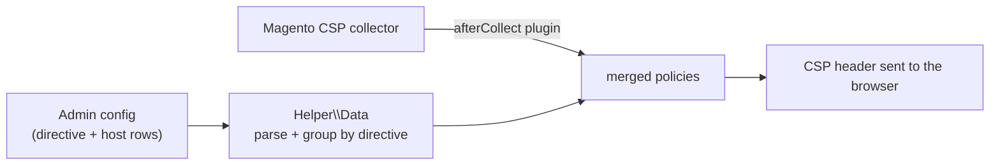

# Softcode_CspWhitelist

Manage Magento 2's **Content Security Policy (CSP)** whitelist from the admin.

Magento 2.4 ships with CSP in report-only mode and expects extra allowed hosts to
be declared in each module's `csp_whitelist.xml`. That means a developer and a
deploy for every new third-party host. This module lets a store admin add allowed
hosts per directive (`script-src`, `style-src`, `img-src`, …) directly under
**Stores → Configuration**, and merges them into the collected policy at runtime.

---

## Requirements

- Magento **2.4.x** (with `Magento_Csp`)
- PHP **8.1** or **8.2**

## Installation

```bash
composer require softcode/module-csp-whitelist
bin/magento setup:upgrade
bin/magento setup:di:compile
bin/magento cache:flush
```

Or copy to `app/code/Softcode/CspWhitelist` and run the same commands.

## Configuration

**Stores → Configuration → Softcode → CSP Whitelist**:

1. **Enable** the feature.
2. Add rows of *directive* (e.g. `script-src`) + *host* (e.g. `*.google.com`).
   The grid starts empty — the module never seeds hosts on your behalf, so you only
   ever allow what you explicitly add.

Every host is **validated and canonicalised when you save**. An entry that is not a
safe host-source (a bare `*`, a `data:`/`javascript:` scheme, a keyword like
`'unsafe-inline'`, a path, or a malformed host) aborts the save with a message
naming the offending value — see [Security & validation](#security--validation).

---

## How it works



`Plugin\Csp::afterCollect` runs after Magento collects the default whitelist. When
the feature is enabled it reads the admin rows via `Helper\Data`, groups the hosts
by directive, and appends a `FetchPolicy` for each — so nothing overrides the
built-in policy, it only adds to it.

## Security & validation

Because a CSP whitelist is a browser-security control, input is validated **on save**
by `Config\Backend\ArraySerialized`, which delegates to `Model\HostValidator`:

- **Accepted:** `[scheme://] host [:port]` where the scheme (optional) is `https` or
  `wss`, and the host is a domain — optionally with a single leading `*.` wildcard
  label (`*.example.com`) — or `localhost`.
- **Rejected, with a reason:** a bare `*`, a wildcard on a bare TLD (`*.com`) or
  anywhere but the leading label, insecure (`http:`/`ws:`) and other schemes
  (`data:`, `javascript:`, `ftp:` …), keyword sources (`'self'`, `'unsafe-inline'`,
  nonces, hashes), paths/queries, and malformed hosts. Only the seven directives in
  the dropdown are allowed.
- Hosts are **canonicalised** (trimmed, lower-cased, trailing `/` removed) and
  **deduplicated** per directive — on save and again when the policy is built.

Access to the configuration section is guarded by the ACL resource
`Softcode_CspWhitelist::config` (`etc/acl.xml`). See [SECURITY.md](SECURITY.md) for
the full threat model and the accept/reject table.

## Testing

The unit tests are pure logic and **run without a Magento install** — a small
`Test/bootstrap.php` autoloads the module and stubs the few Magento contracts the
tests mock (skipped automatically inside a real Magento install):

```bash
phpunit -c phpunit.xml.dist
```

- `HostValidatorTest` — the accept/reject/canonicalise rules and per-directive
  deduplication (the security core).
- `DataTest` — invalid/empty JSON returning no hosts, grouping by directive,
  skipping incomplete rows, and read-side deduplication.

## What CI checks

GitHub Actions runs on every push/PR and **fails the build** on:

- PHP syntax errors and Magento 2 coding-standard errors (`phpcs --standard=Magento2 -n`).
- **Unit-test failures** — `phpunit -c phpunit.xml.dist` runs the suite above on
  every push, as a real gate.

## Known limitations

- Wildcards are restricted to a single leading label (`*.example.com`), but the
  validator does not consult the Public Suffix List, so `*.example.co.uk` is
  accepted. Grant admin access only to trusted roles.
- Hosts are appended to the collected policy; the module does not remove hosts that
  Magento or other modules already whitelist.

## License

MIT — see [LICENSE](LICENSE).
