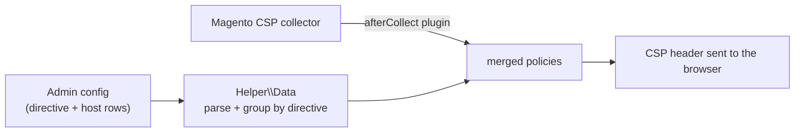

# Softcode_CspWhitelist

Manage Magento 2's **Content Security Policy (CSP)** whitelist from the admin.

Magento 2.4 ships with CSP in report-only mode and expects extra allowed hosts to
be declared in each module's `csp_whitelist.xml`. That means a developer and a
deploy for every new third-party host. This module lets a store admin add allowed
hosts per directive (`script-src`, `style-src`, `img-src`, …) directly under
**Stores → Configuration**, and merges them into the collected policy at runtime.

---

## Requirements

- Magento **2.4.x** (with `Magento_Csp`)
- PHP **8.1** or **8.2**

## Installation

```bash
composer require softcode/module-csp-whitelist
bin/magento setup:upgrade
bin/magento setup:di:compile
bin/magento cache:flush
```

Or copy to `app/code/Softcode/CspWhitelist` and run the same commands.

## Configuration

**Stores → Configuration → Softcode → CSP Whitelist**:

1. **Enable** the feature.
2. Add rows of *directive* (e.g. `script-src`) + *host* (e.g. `*.google.com`).
   A one-click button seeds common third-party hosts to start from.

---

## How it works



`Plugin\Csp::afterCollect` runs after Magento collects the default whitelist. When
the feature is enabled it reads the admin rows via `Helper\Data`, groups the hosts
by directive, and appends a `FetchPolicy` for each — so nothing overrides the
built-in policy, it only adds to it.

## Testing

`Helper\Data` turns the serialized admin field into grouped, per-directive hosts and
generates the default seed values, so it has a unit test that specifies that parsing:

```bash
# from a Magento install with the module in app/code/Softcode/CspWhitelist
vendor/bin/phpunit -c dev/tests/unit/phpunit.xml.dist \
  app/code/Softcode/CspWhitelist/Test/Unit
```

`DataTest` covers invalid/empty JSON returning no hosts, hosts being grouped by
directive, rows with a missing directive or host being skipped, and the default
seed being every host × every policy.

## What CI checks

GitHub Actions runs on every push/PR and **fails the build** on PHP syntax errors
and Magento 2 coding-standard errors (`phpcs --standard=Magento2 -n`). It does not
run the unit tests (those need a Magento framework install); run them locally as
shown above.

## Known limitations

- Hosts are validated as free text; enter them in CSP source form (`*.example.com`).
- The feature is store-scope aware but does not deduplicate identical hosts.

## License

MIT — see [LICENSE](LICENSE).
